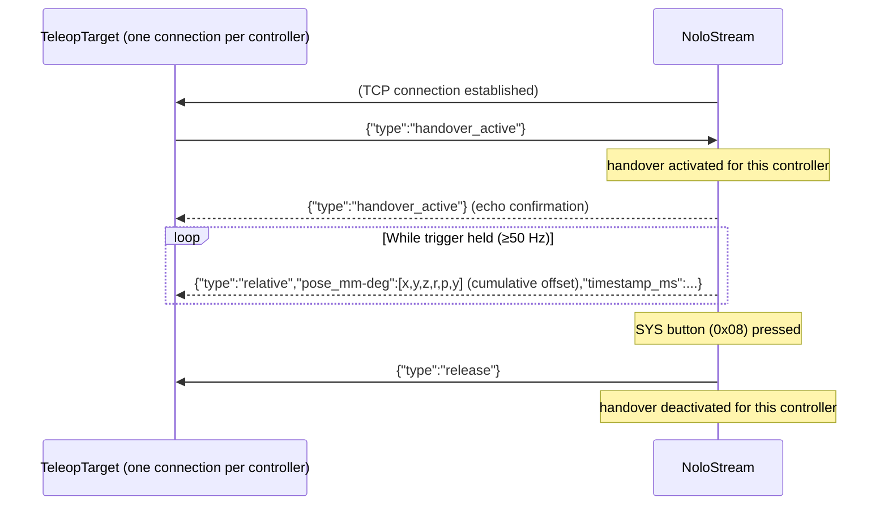

# Teleop API

Teleop turns NoloStream into a **robot remote-control input device**.  
The server processes controller pose data and emits compact **offset frames** — the cumulative motion since handover — to separate per-controller TCP endpoints.  
A *TeleopTarget* (a robot or miniviz acting as one) initiates the handover (which zeroes the offset) and then follows the controller offset.

---

## Coordinate system

Teleop data uses the **robotics convention**:

| Axis | Direction |
|------|-----------|
| X    | Calibrated left-to-right (see yaw calibration below) |
| Y    | Horizontal, orthogonal to X (forward/backward after calibration) |
| Z    | Vertical, up is positive |

This is a **right-handed, Z-up** coordinate system.

Raw tracker coordinates are Y-up (Y = up, Z = forward/backward, X = right).  
The teleop module performs the conversion automatically:

```
robot_x = tracker_x
robot_y = −tracker_z
robot_z =  tracker_y
```

For orientation quaternions the axis vector is transformed the same way:
`q_robot = [w, qx, −qz, qy]` from the tracker quaternion `[w, qx, qy, qz]`.

---

## Yaw calibration

**Trigger**: **long-press** the **Menu button** (bit `0x04`, held ≥ 400 ms) on either controller.  
Both controllers must be visible at the moment of the press.

**Effect**: the horizontal vector from the **left controller to the right controller** becomes the **+X axis** in all subsequent teleop output.

This lets you calibrate the robot's forward/right directions to your physical setup without modifying the tracker position.  
If calibration has never been performed, X aligns with the raw tracker X axis.

## Filter reset (per controller)

**Trigger**: **short-press** the **Menu button** (held < 400 ms) on one controller.

**Effect**: that controller's UKF is reset to its initial state — orientation re-initialized from gravity (yaw = 0, pitch/roll from the accelerometer), position from the optical tracker, velocity and gyro bias zeroed, covariance reset, and the brief startup still-calibration re-run. Hold the controller steady for ~2 s after the press for the bias calibration to settle.

---

## Offset streaming

**Trigger**: hold the **Trigger button** (bit `0x02`) on a controller **while handover is active**.

While held, every poll cycle produces a `TeleopFrame` carrying the **cumulative offset** of the controller since the last `handover_active` — the running sum of motion made *while the trigger is held*. This is **not** a frame-to-frame delta: each frame fully specifies where the target should be relative to its handover pose, so a dropped frame causes no drift.

- The first frame after a trigger press is the offset so far (zero right after a handover).
- Releasing the trigger **freezes** the accumulator. Motion made with the trigger released is **not** counted, and re-pressing resumes from the same total — this is the clutch / re-indexing mechanism.
- `handover_active` re-zeros the accumulator (see [Handshake protocol](#handshake-protocol)).

### `TeleopFrame` JSON fields

```json
{
  "type": "relative",
  "pose_mm-deg": [12.0, 0.0, -8.0, 1.5, 0.0, -3.0],
  "timestamp_ms": 1715702400123
}
```

Note: there is **no `device` field** in the frame — the TCP endpoint identifies the controller.

| Field | Type | Description |
|-------|------|-------------|
| `type` | string | Always `"relative"` (relative to the handover pose, not the previous frame) |
| `pose_mm-deg` | `[x, y, z, roll, pitch, yaw]` f32 | Cumulative position offset in **mm** (Z-up) + cumulative orientation offset as **ZYX extrinsic Euler angles** in degrees, both measured since the last `handover_active` |
| `timestamp_ms` | u64 | Host time of the **current** frame, ms since UNIX epoch |

**Euler convention**: ZYX extrinsic (KUKA A/B/C order) — `R = Rz(yaw) × Ry(pitch) × Rx(roll)`.

The offset grows as you move, holds steady when you stop, and returns to zero at the next handover.

## Handshake protocol

There are **two independent TCP endpoints** — one per controller. NoloStream acts as the **TCP client** and connects outward to the addresses you specify with `--teleop-left-to` and `--teleop-right-to`. The TeleopTarget must be listening before the server starts.



### State machine (per controller endpoint)

| State | Description |
|-------|-------------|
| `Inactive` | Default. TCP connected but no `handover_active` received. No frames sent. |
| `Active` | `handover_active` received and echoed; resets the offset accumulator. Forwards cumulative-offset frames when trigger held. SYS button → Inactive. |

### Messages

**TeleopTarget → NoloStream**

| Message | Description |
|---------|-------------|
| `{"type":"handover_active"}` | Activate handover for this controller endpoint |

**NoloStream → TeleopTarget**

| Message | Description |
|---------|-------------|
| `{"type":"handover_active"}` | Echo — confirms handover is active |
| `{"type":"relative","pose_mm-deg":[x,y,z,roll,pitch,yaw],"timestamp_ms":N}` | Cumulative-offset frame (since handover) while trigger held |
| `{"type":"release"}` | Handover ended (SYS button pressed) |

---

## Wire format

All messages are newline-terminated JSON objects sent over **individual TCP streams** (one per controller):

```
{"type":"handover_active"}\n
{"type":"relative","pose_mm-deg":[12.0,0.0,-8.0,1.5,0.0,-3.0],"timestamp_ms":123456}\n
{"type":"release"}\n
```

The TCP endpoint identifies the controller — there is no `device` field in the frames.

---

## Server configuration

```bash
# Connect to a robot's left and right teleop listeners
./nolostream_server \
  --teleop-left-to  192.168.1.100:9001 \
  --teleop-right-to 192.168.1.100:9002
```

NoloStream acts as **TCP client** and connects to the addresses specified by `--teleop-left-to` and `--teleop-right-to`. The TeleopTarget must be listening on those ports.

Each flag is independent — you can connect only one controller at a time if needed.

### Robot-side application

On `handover_active`, snapshot the current end-effector pose as the **anchor**
`(anchor_pos_mm, anchor_rot)`. Each frame then **sets** the target from the
cumulative offset — it does *not* accumulate, because the offset is already
cumulative:

```python
# position (mm): world-frame offset added to the anchor
ee_pos_mm[0] = anchor_pos_mm[0] + pose_mm_deg[0]  # x
ee_pos_mm[1] = anchor_pos_mm[1] + pose_mm_deg[1]  # y
ee_pos_mm[2] = anchor_pos_mm[2] + pose_mm_deg[2]  # z

# orientation: offset (ZYX extrinsic Euler) as a world-frame rotation on the anchor
offset_rot = rpy_deg_to_quat(pose_mm_deg[3], pose_mm_deg[4], pose_mm_deg[5])
ee_rot = offset_rot * anchor_rot   # left-multiply in the world frame
```

Because each frame is absolute relative to the anchor, dropped frames never drift
the target, and re-sending `handover_active` re-zeros it at the current pose.

---

## Rust library API

```rust
use nolostream::{TeleopFrame, TeleopState, TeleopUpdate};

// In your poll loop (TeleopState is embedded in NoloStream):
let poses = stream.poll_once()?;
// Teleop frames and handover messages are automatically dispatched
// to TcpTeleopTransport instances attached to the stream.
```

For a custom integration, construct the state machine directly:

```rust
let mut teleop = TeleopState::new();
let update: TeleopUpdate = teleop.update(&poses);
// update.frames  — cumulative-offset frames to forward (TeleopFrame per controller)
// update.handover_out — optional HandoverMsg::Release to broadcast
// Call teleop.reset_accumulator(&device) when a transport reports handover_active
// (see Transport::take_handover_activations) to re-zero that controller's offset.
```

`TeleopState` is embedded inside `NoloStream` and updated automatically.

For the **client-api** path (`--client-api` flag), a standalone `TeleopState` is maintained in the server binary and dispatched the same way.

---

## Miniviz

Miniviz can act as a **dual TeleopTarget** for testing — it listens on two TCP ports for NoloStream connections (one per controller) and relays the data to the browser via a WebSocket.

Two wireframe target boxes appear in the 3D scene:

- **Green (L)** — left controller teleop target
- **Yellow (R)** — right controller teleop target

When you hold the trigger and move the controller (handover active), the corresponding target box moves and rotates accordingly. Each box follows its cumulative offset **anchored in place**: when `handover_active` arrives, the box snapshots its current pose as the anchor, and subsequent frames *set* the box to `anchor ⊕ offset` (the offset is already cumulative, so the box is not re-accumulated). Re-sending START re-zeros without moving the box, exactly like a robot end-effector.

The coordinate conversion from Z-up (teleop) back to Y-up (Babylon.js scene) is:

```
viz_x =  robot_x
viz_y =  robot_z   (robot Z-up → viz Y-up)
viz_z = −robot_y
```

Euler angles are converted to a quaternion via `rpyDegToQuat(roll, pitch, yaw)` (ZYX extrinsic) and left-multiplied onto the anchor orientation before applying to the mesh.

Use the **RESET** button to return both targets and their anchors to the origin. RESET is a viz-only action that takes effect when teleop is **idle** — it does not reset the server's accumulator, so while a trigger is held the next frame's cumulative offset immediately re-positions the box. To re-zero during active teleop, press **START** again (a fresh `handover_active`).  
Use the **START L** / **START R** buttons to send `{"type":"handover_active"}` on the left or right TCP connection. NoloStream will echo back `{"type":"handover_active"}` to confirm (and re-zero that controller's offset).

The overlay shows per-controller handover state:
- `L: handover active` / `R: handover active` — after echo received
- `L: active` / `R: active` — offset frames flowing
- `L: released` / `R: released` — SYS button pressed
