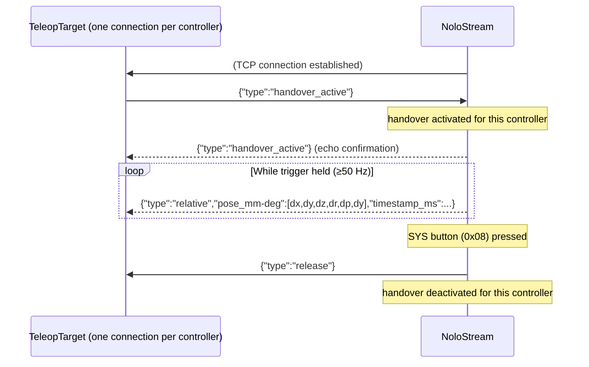

# Teleop API

Teleop turns NoloStream into a **robot remote-control input device**.  
The server processes controller pose data and emits compact, frame-to-frame **delta frames** to separate per-controller TCP endpoints.  
A *TeleopTarget* (a robot or miniviz acting as one) initiates the handover and then follows the controller deltas.

---

## Coordinate system

Teleop data uses the **robotics convention**:

| Axis | Direction |
|------|-----------|
| X    | Calibrated left-to-right (see yaw calibration below) |
| Y    | Horizontal, orthogonal to X (forward/backward after calibration) |
| Z    | Vertical, up is positive |

This is a **right-handed, Z-up** coordinate system.

Raw tracker coordinates are Y-up (Y = up, Z = forward/backward, X = right).  
The teleop module performs the conversion automatically:

```
robot_x = tracker_x
robot_y = −tracker_z
robot_z =  tracker_y
```

For orientation quaternions the axis vector is transformed the same way:
`q_robot = [w, qx, −qz, qy]` from the tracker quaternion `[w, qx, qy, qz]`.

---

## Yaw calibration

**Trigger**: press the **Menu button** (bit `0x04`) on either controller.  
Both controllers must be visible at the moment of the press.

**Effect**: the horizontal vector from the **left controller to the right controller** becomes the **+X axis** in all subsequent teleop output.

This lets you calibrate the robot's forward/right directions to your physical setup without modifying the tracker position.  
If calibration has never been performed, X aligns with the raw tracker X axis.

---

## Delta streaming

**Trigger**: hold the **Trigger button** (bit `0x02`) on a controller **while handover is active**.

While held, every poll cycle produces a `TeleopFrame` for that controller.  
On the first frame when the trigger begins, no delta is emitted (no prior reference exists).  
Frames resume immediately from zero on the next trigger press.

### `TeleopFrame` JSON fields

```json
{
  "type": "relative",
  "pose_mm-deg": [1.0, 0.0, -2.0, 0.1, 0.0, -0.2],
  "timestamp_ms": 1715702400123
}
```

Note: there is **no `device` field** in the frame — the TCP endpoint identifies the controller.

| Field | Type | Description |
|-------|------|-------------|
| `type` | string | Always `"relative"` |
| `pose_mm-deg` | `[x, y, z, roll, pitch, yaw]` f32 | Frame-to-frame position delta in **mm** (Z-up) + orientation delta as **ZYX extrinsic Euler angles** in degrees |
| `timestamp_ms` | u64 | Host time of the **current** frame, ms since UNIX epoch |

**Euler convention**: ZYX extrinsic (KUKA A/B/C order) — `R = Rz(yaw) × Ry(pitch) × Rx(roll)`.

Position deltas are in millimetres; at 60–120 Hz a typical delta is ≪ 1 mm.

## Handshake protocol

There are **two independent TCP endpoints** — one per controller. NoloStream acts as the **TCP client** and connects outward to the addresses you specify with `--teleop-left-to` and `--teleop-right-to`. The TeleopTarget must be listening before the server starts.



### State machine (per controller endpoint)

| State | Description |
|-------|-------------|
| `Inactive` | Default. TCP connected but no `handover_active` received. No frames sent. |
| `Active` | `handover_active` received and echoed. Forwards delta frames when trigger held. SYS button → Inactive. |

### Messages

**TeleopTarget → NoloStream**

| Message | Description |
|---------|-------------|
| `{"type":"handover_active"}` | Activate handover for this controller endpoint |

**NoloStream → TeleopTarget**

| Message | Description |
|---------|-------------|
| `{"type":"handover_active"}` | Echo — confirms handover is active |
| `{"type":"relative","pose_mm-deg":[dx,dy,dz,roll,pitch,yaw],"timestamp_ms":N}` | Delta frame while trigger held |
| `{"type":"release"}` | Handover ended (SYS button pressed) |

---

## Wire format

All messages are newline-terminated JSON objects sent over **individual TCP streams** (one per controller):

```
{"type":"handover_active"}\n
{"type":"relative","pose_mm-deg":[1.0,0.0,-2.0,0.1,0.0,-0.2],"timestamp_ms":123456}\n
{"type":"release"}\n
```

The TCP endpoint identifies the controller — there is no `device` field in the frames.

---

## Server configuration

```bash
# Connect to a robot's left and right teleop listeners
./nolostream_server \
  --teleop-left-to  192.168.1.100:9001 \
  --teleop-right-to 192.168.1.100:9002
```

NoloStream acts as **TCP client** and connects to the addresses specified by `--teleop-left-to` and `--teleop-right-to`. The TeleopTarget must be listening on those ports.

Each flag is independent — you can connect only one controller at a time if needed.

The robot should maintain an end-effector pose `(position_mm, [roll, pitch, yaw])` and accumulate each delta:

```python
## Robot-side application

The robot should maintain an end-effector pose `(position_mm, [roll, pitch, yaw])` and accumulate each delta:

```python
# position (mm): add deltas directly
ee_pos_mm[0] += pose_mm_deg[0]  # x
ee_pos_mm[1] += pose_mm_deg[1]  # y
ee_pos_mm[2] += pose_mm_deg[2]  # z

# orientation: accumulate Euler angles (ZYX extrinsic)
ee_rpy_deg[0] += pose_mm_deg[3]  # roll
ee_rpy_deg[1] += pose_mm_deg[4]  # pitch
ee_rpy_deg[2] += pose_mm_deg[5]  # yaw
```

Alternatively convert to a quaternion and apply as left-multiplication in the world frame.

---

## Rust library API

```rust
use nolostream::{TeleopFrame, TeleopState, TeleopUpdate};

// In your poll loop (TeleopState is embedded in NoloStream):
let poses = stream.poll_once()?;
// Teleop frames and handover messages are automatically dispatched
// to TcpTeleopTransport instances attached to the stream.
```

For a custom integration, construct the state machine directly:

```rust
let mut teleop = TeleopState::new();
let update: TeleopUpdate = teleop.update(&poses);
// update.frames  — delta frames to forward (TeleopFrame per controller)
// update.handover_out — optional HandoverMsg::Release to broadcast
```

`TeleopState` is embedded inside `NoloStream` and updated automatically.

For the **client-api** path (`--client-api` flag), a standalone `TeleopState` is maintained in the server binary and dispatched the same way.

---

## Miniviz

Miniviz can act as a **dual TeleopTarget** for testing — it listens on two TCP ports for NoloStream connections (one per controller) and relays the data to the browser via a WebSocket.

Two wireframe target boxes appear in the 3D scene:

- **Green (L)** — left controller teleop target
- **Yellow (R)** — right controller teleop target

When you hold the trigger and move the controller (handover active), the corresponding target box moves and rotates accordingly.  
The coordinate conversion from Z-up (teleop) back to Y-up (Babylon.js scene) is:

```
viz_x =  robot_x
viz_y =  robot_z   (robot Z-up → viz Y-up)
viz_z = −robot_y
```

Euler angles are converted to a quaternion via `rpyDegToQuat(roll, pitch, yaw)` (ZYX extrinsic) before applying to the mesh.

Use the **RESET** button to return both targets to the origin.  
Use the **START L** / **START R** buttons to send `{"type":"handover_active"}` on the left or right TCP connection. NoloStream will echo back `{"type":"handover_active"}` to confirm.

The overlay shows per-controller handover state:
- `L: handover active` / `R: handover active` — after echo received
- `L: active` / `R: active` — delta frames flowing
- `L: released` / `R: released` — SYS button pressed
